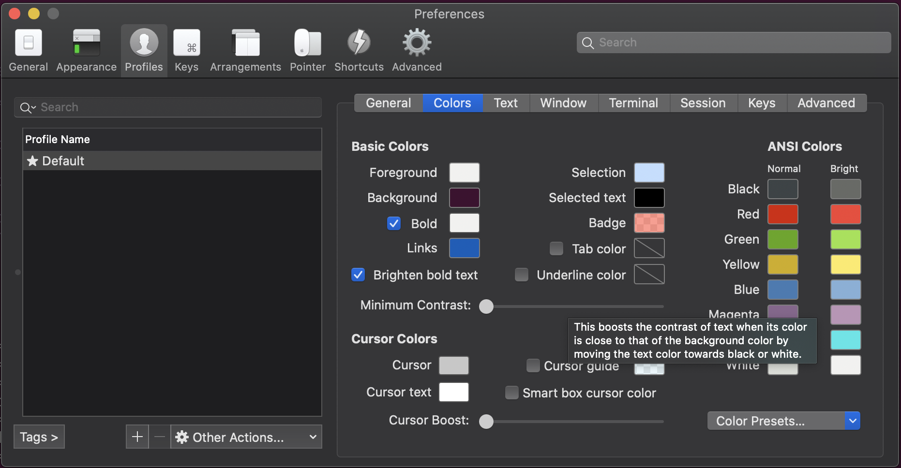

<escape><!--more--></escape>

## 一、安装Homebrew

	直接安装Homebrew速度很慢，采用换源安装的方式
	
	先从`https://raw.githubusercontent.com/Homebrew/install/master/install.sh`下载安装脚本，改写其中的`BREW_REPO`

```python
BREW_REPO="https://github.com/Homebrew/brew"
# 变成：
BREW_REPO="https://mirrors.tuna.tsinghua.edu.cn/git/homebrew/brew.git"
```

	运行`install.sh`进行安装

```python
HOMEBREW_CORE_GIT_REMOTE=https://mirrors.tuna.tsinghua.edu.cn/git/homebrew/homebrew-core.git bash install.sh
```

	替换现有上游：

```python
git -C "$(brew --repo)" remote set-url origin https://mirrors.tuna.tsinghua.edu.cn/git/homebrew/brew.git
git -C "$(brew --repo homebrew/core)" remote set-url origin https://mirrors.tuna.tsinghua.edu.cn/git/homebrew/homebrew-core.git
```

	之后切换到`usr/local/Homebrew/Library/Taps/homebrew`目录下面，使用如下指令从清华源上拉取repo：

```python
git clone https://mirrors.tuna.tsinghua.edu.cn/git/homebrew/homebrew-cask.git
```


## 二、安装iterm2和oh-my-zsh

	iterm2直接使用brew install安装即可

```python
brew install iterm2
```

	oh-my-zsh使用如下指令安装：

```python
sh -c "$(curl -fsSL https://raw.github.com/robbyrussell/oh-my-zsh/master/tools/install.sh)"
```

	这时候bash会自动切换到zsh，然后导入一些配色方案

```python
mkdir ～/iterm2
cd ~/iterm2
git clone https://github.com/mbadolato/iTerm2-Color-Schemes
```

	在终端里使用`command+,` 打开配置，导入之前的配色



	在右下角的Color Presets里选择Import，然后选择`~/iterm2/iTerm2-Color-Schemes/schemes`下的所有配色方案包，导入即可
	
	之后就可以选择里面最喜欢的一款配色方案来应用，同时关于终端里的一些设置也是在这里进行调整的。


## 三、语法高亮和指令补全

	直接使用brew安装即可

```python
brew install zsh-syntax-highlighting
brew install zsh-autosuggestions
```


## 四、其他扩展

	可以尝试配置powerlevel9k，非常炫酷。但是在配置之后会出现部分字符乱码的问题，需要配置相应的字体进行解决，相关的配置方法在网上有很多参考资料。
	
	我个人配置完之后感觉终端不是很简洁，不能适应powerlevel9k的观感，所以就不进行介绍了。


## 五、tmux

	Tmux可以较为方便的实现终端复用，非常建议安装。直接用brew安装即可：

```
brew install tmux
```

	在终端里输入`tmux`即可进入tmux
	
	tmux的前缀键是`Ctrl+b`，之后可以完成各种快捷操作，其中跟窗格有关且较为常用的操作如下：

```
Ctrl+b % 水平切割
Ctrl+b " 竖直切割
Ctrl+b <方向键> 切换窗格
Ctrl+b x 关闭当前窗格
```

	由于在mac的键盘上`Ctrl+b`比较远，所以建议修改前缀键，在`~/.tmux.conf`里进行修改 (如果没有该文件就创建一个)：

```python
set -g prefix C-a
unbind C-b
```

	这里修改后的前缀键是`Ctrl+a`, 重启tmux使其生效即可

最终效果大致如下 (Ubuntu配色)：


## 参考资料

	[1] 换tuna源 https://mirror.tuna.tsinghua.edu.cn/help/homebrew/	
	
	[2] 舒适美观的mac终端 http://www.imooc.com/article/292397

 
